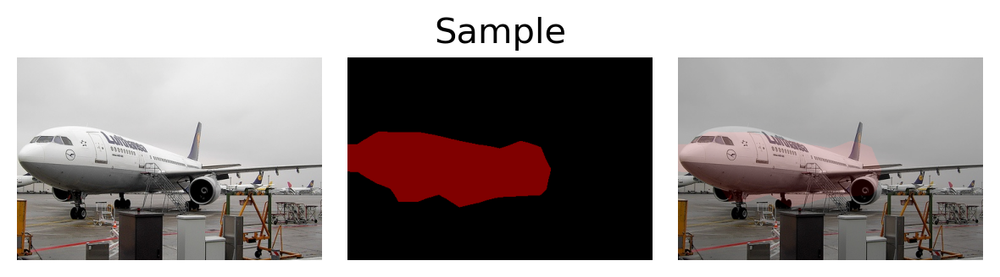

# Pytorch_Segmentation


[](./License.txt)

## Train 
### (1) Download VOC2012 dataset 
### (2) untar VOC2012 dataset and put it in dataset like below (with VOCdevkit)
``` shell 
└── dataset           
    └── VOCdevkit
        └── VOC2012
```
### (3) Implement training
``` shell
python train.py
```


## Predict
### Just Run Predict.ipynb

## Display VOC dataset
### Just Run VOC_Seg_display.ipynb

## Display Image
