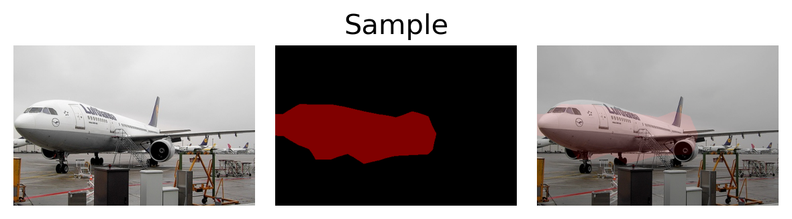

# Pytorch_Segmentation

## Prepare 
### (1) Download VOC2012 dataset 
### (2) untar VOC2012 dataset and put it in dataset (with VOCdevkit)

## Train
    python train.py

## Predict
### Just Run Predict.ipynb

## Display VOC dataset
### Just Run VOC_Seg_display.ipynb

## Display Image
